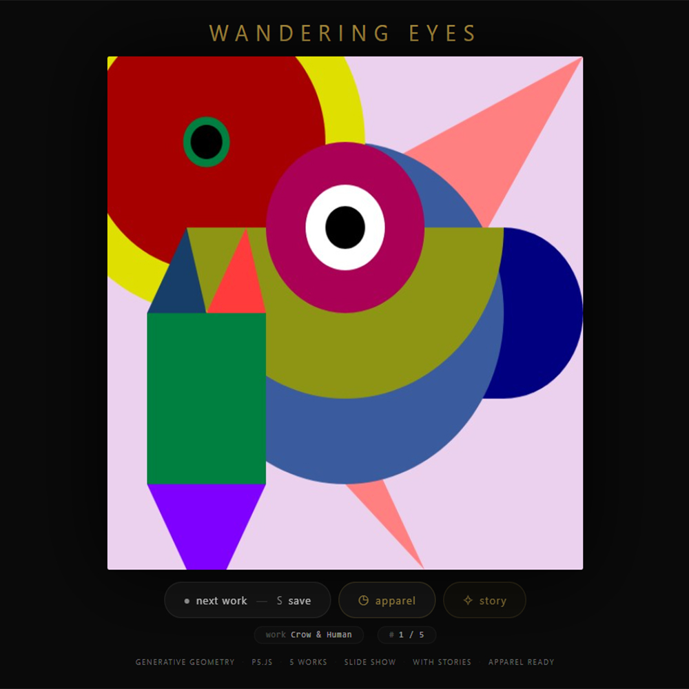
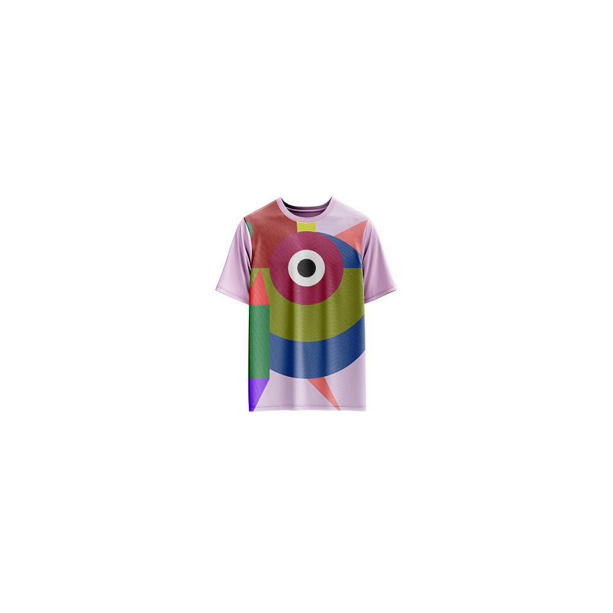

# Wandering Eyes — Generative Art

[](https://reyrove.github.io/Wandering-Eyes-Generative-Art)
[](https://opensource.org/licenses/MIT)

> **Generative art meets storytelling.** A curated slideshow of 5 unique generative artworks, each with its own story, exploring the intersection of code, color, and imagination.

## 🎨 Live Demo

<div align="center">
  <a href="https://reyrove.github.io/Wandering-Eyes-Generative-Art" target="_blank">
    
  </a>
  <br><br>
  <a href="https://reyrove.github.io/Wandering-Eyes-Generative-Art" target="_blank">
    
  </a>
  <br>
  <em>Click the image or button to experience the generative art</em>
</div>

## 👕 Apparel Preview

<div align="center">
  
  <br>
  <em>Wandering Eyes artwork printed on a T-shirt</em>
</div>

## ✨ Features

- **5 Unique Works** — A curated collection of generative art pieces
- **Storytelling** — Each artwork has its own story, revealed on demand
- **Slideshow Navigation** — Browse through the collection
- **Seed-Based** — Every composition is unique and reproducible
- **Save & Share** — Download any artwork as PNG
- **Apparel Mode** — Preview artwork on a T-shirt mockup
- **Responsive** — Works on desktop, tablet, and mobile
- **Keyboard Shortcuts**:
  - `→` or `N` — Next work
  - `←` or `P` — Previous work
  - `Space` — Next work
  - `S` — Save image
  - `A` — Toggle apparel
  - `C` — Toggle story

## 🎯 Artworks

| # | Title | Description |
|---|-------|-------------|
| I | **Crow & Human** | A geometric exploration of connection between earth and sky, where circles, rectangles, and triangles weave a tapestry of color and imagination. |
| II | **Rove Column** | A structural meditation on impermanence—where geometric shapes form a column that carries the weight of forgotten civilizations. |
| III | **Dance Studio** | An abstract celebration of movement, where colorful shapes dance across the canvas in rhythmic harmony. |
| IV | **Beyond the Tears** | A poignant journey from sorrow to light, featuring rain effects and an eye that sees beyond the veil of tears. |
| V | **The Eye of the World** | The silent observer of existence—where all things are connected in the infinite dance of creation. |

## 🚀 Quick Start

### Local Development

```bash
# Clone the repository
git clone https://github.com/reyrove/Wandering-Eyes-Generative-Art.git

# Navigate to the directory
cd Wandering-Eyes-Generative-Art

# Open in browser
open index.html
# or use a live server
```

### Deploy to GitHub Pages

1. Push to GitHub
2. Go to Settings → Pages
3. Select branch `main` and root folder
4. Your site will be live at `https://reyrove.github.io/Wandering-Eyes-Generative-Art`

## 🧠 How It Works

The collection features 5 generative artworks, each created with p5.js and a deterministic random number generator:

1. **Artwork Generation**:
   - Each piece is built with geometric shapes (circles, rectangles, triangles, arcs)
   - Random color palettes and compositions
   - Unique visual style for each artwork

2. **Storytelling**:
   - Each artwork has a narrative story
   - Stories are revealed in a beautiful modal
   - Roman numerals (I-V) for chapter-like presentation

3. **Navigation**:
   - Smooth transitions between artworks
   - Keyboard shortcuts for easy browsing
   - Touch-friendly for mobile

## 📁 File Structure

```
Wandering-Eyes-Generative-Art/
├── index.html              # Main application (all-in-one)
├── crow-human.jpg          # Artwork 1
├── rove-column.jpg         # Artwork 2
├── dance-studio.jpg        # Artwork 3
├── beyond-the-tears.gif    # Artwork 4 (animated)
├── th-eye-of-the-world.jpg # Artwork 5
├── Wandering-Eyes.jpg      # T-shirt mockup image
├── fav.svg                 # Favicon
├── demo-screenshot.jpg     # Website demo screenshot
├── README.md               # This file
└── LICENSE                 # MIT License
```

## 🛠️ Tech Stack

- **Vanilla HTML/CSS/JS** — No dependencies
- **p5.js** — Generative art creation
- **CSS Flexbox/Grid** — Responsive layout
- **GitHub Pages** — Hosting

## 🎯 Interactive Controls

| Action | Keyboard | Button |
|--------|----------|--------|
| Next Work | `→` or `N` or `Space` | Click "next work" |
| Previous Work | `←` or `P` | — |
| Save Image | `S` | Click "next work" |
| Toggle Apparel | `A` | Click "apparel" |
| Toggle Story | `C` | Click "story" |

## 🎨 Design Inspiration

The collection explores themes of:
- **Connection** — Between beings, worlds, and ideas
- **Impermanence** — The beauty of decay and change
- **Movement** — Dance, rhythm, and flow
- **Transformation** — From sorrow to light
- **Observation** — The witness of all things

## 📱 Responsive Design

The application automatically adapts to:
- Desktop screens
- Tablets
- Mobile phones
- Landscape orientation
- Various aspect ratios

## 🤝 Contributing

Contributions are welcome! Feel free to:
- Fork the repository
- Create a feature branch
- Submit a pull request

### Ideas for Contributions:
- Add more artworks
- New visual styles
- Enhanced storytelling features
- Performance optimizations

## 📄 License

MIT License — see [LICENSE](LICENSE) file for details.

## 🙏 Acknowledgments

- Created with p5.js
- Inspired by generative art and storytelling
- Special thanks to the creative coding community

---

**Built with ❤️ and wandering eyes**